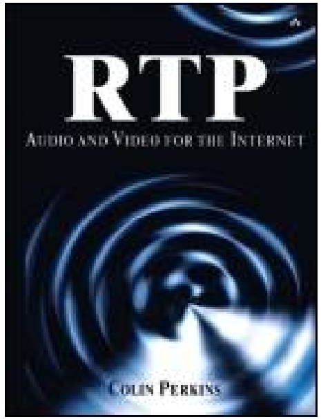

# RTP: Audio and Video for the Internet 中文版

#### 作者：Colin Perkins

#### 译者：51Talk人工智能与多媒体研发部

## 目的

由于这本书成书于2003年，当时的RTP并没有立刻成为非常重要的技术，这个情况在2012年开始WebRTC逐渐成为主流技术后发生了改变。然而没有哪个出版社会去翻译一本10年前的技术书籍，以至于很多工程技术人员学习RTP协议、实时音视频技术、WebRTC的途径居然是直接翻墙下载WebRTC的源码。但现实情况是，如果没有很好的理解RTP协议和相关的知识，直接读WebRTC的收获只是无源之水无本之木，是不可能对实时流媒体技术真正深刻理解的。

为提升团队对RTP协议的理解，提升整个团队的技术能力，我们共同翻译RTP这本神书。这本书是个非常完美的学习实时音视频技术以及流媒体传输技术的起点，读者可以从这本书出发，阅读更多的RFC文件，或者像本书作者Colin Perkings这样大牛的博客以获取更多知识。

在此感谢51Talk技术部的支持，特别是感谢51Talk人工智能与多媒体研发部音视频组同事的努力付出，现列出参与翻译人员如下：

| 人员    | 翻译章节 | 角色    | 邮箱 |
| ----| ---- | ---- | ---- |
| 陈靖   |  全部 |  总校对  |jingchen@51talk.com / jingcmu@qq.com|
| 陈震   |  第二部分(第五章、第六章) | |chenzhen01@51talk.com / gatescz2003@163.com|
| 刘长安   |  第三部分(第八章) | |liuchangan@51talk.com / lcalqf@126.com|
| 王庆功   |  第一部分（第一章，第二章） 第二部分（第三章，第四章）第四部分(第十二章) |  校对  |wangqinggong@51talk.com / qinggongking@163.com|
| 龚宸鑫   |  第三部分（第九章）| |gongchenxin@51talk.com / 412700829@qq.com|
| 刘海涛   |  第三部分（第十章）| |liuhaitao@51talk.com / sea_haitao@163.com|
| 于坤雷   |  第四部分(第十一章) | |yukunlei@51talk.com / lmtap@outlook.com|
| 鲁志威   |  第二部分（第七章）	| |luzhiwei@51talk.com / luzhiwei2015@126.com|
| 潘胜良   |  第四部分(第十三章) | |panshengliang@51talk.com / iampsl@qq.com|
| 王学敏   | |  审核  |wangxuemin@51talk.com / 904605237@qq.com|
| 白旭辉   | |  审核  |baixuhui@51talk.com / 13560724628@163.com|

由于涉及到很多专业术语，本书的翻译过程非常辛苦，也必然存在大量不足之处。读者发现任何翻译问题请不吝指正。

请将建议和意见发送至：

陈靖 jingchen@51talk.com 或 jingcmu@qq.com 

陈震 chenzhen01@51talk.com 或 gatescz2003@163.com

## 总目录
----
### Part1：网络多媒体介绍 介绍问题空间，提供背景，并概述音视频传输的互联网属性

* 第一章：RTP介绍
本章包括实时传输协议的简介，RTP和其他标准的关系的概述以及本书讨论范围的描述。

* 第二章：分组网络上的语音和视频通信
本章描述了IP网络提供的独特环境，以及该环境如何影响基于数据包传输的音视频应用。

### Part2：基于RTP的网络媒体传输 本部分讨论了RTP的基础

* 第三章: 实时传输协议
本章介绍了RTP和相关标准，描述了它们如何组合在一起，并概述了支持该协议的设计理念。

* 第四章:RTP 数据传输协议
本章详细说明了用于通过IP网络传输视听数据的传输协议。

* 第五章: RTP控制协议
本章描述了提供接收质量反馈、成员资格控制和同步的控制协议。

* 第六章：媒体采集、播放及时序
本章解释了接收器如何重组音视频数据以及如何按正确的时序给用户播放。

* 第七章: 音视频同步
本章解决了一个相关问题：如何同步媒体流（例如，获取音视频同步）。

### Part3：健壮性 本部分讨论如何在面对网络问题时使你的应用程序更加可靠，以及如何补偿网络中的丢包和拥塞。虽然你可以在不使用这些技术的基础下建立系统，但是如果应用它们会使你的音视频用起来好很多，并且传输的图像会更加平稳及不易损坏

* 第八章：错误隐藏
本章处理了由于接收不完全而导致的隐藏错误的问题，描述了接收者可以用来隐藏网络问题的几种技术。

* 第九章：纠错
本章描述了可用于修复丢包的媒体流的技术，其中发送方和接收方合作修复媒体流。

* 第十章：拥塞控制
本章讨论了因特网对拥塞的响应方式，以及这种方式如何影响音/视频应用的设计。

### Part4：高阶话题 本部分介绍了使用更专业用途的各种技术，虽然许多实现用不到这些技术，但是在某些情况下它可以提高性能

* 第十一章: 头部压缩
本章概述了一种可以显著提高RTP在低速网络链路（例如拨号调制解调器或蜂窝无线链路）上效率的技术。

* 第十二章:复用和隧道技术
本章描述了如何将几个媒体流组合成一个，其目的是在网关设备之间传输许多相似流时能够提高效率。

* 第十三章：安全问题
本章描述了如何使用加密和身份验证技术来保护RTP会话；它还描述了常见的安全和隐私问题。

### 术语表：
| 英文 | 中文参照 | 说明 |
| ----| ---- | ---- |
| Voice activity detection	| 语音活动检测	| |
|Transit time| 传输时间	||
|Timing|时序||
|Talk spurts|通话期	|通话期是指终端上行链路发送语音数据包或下行链路接收语音数据包的时期；语音数据包的发送周期为20ms；语音包大小取决于当前采用的编码速率|
|Streaming|流媒体	||
|Stream Protocol|流协议	||
|Silent periods	|静默期	|静默期是指终端上行链路发送SID（Silence Insertion Descriptor）帧或下行链路上接收到SID帧的时期；SID帧的发送周期为160ms；对于AMR语音编码速率，SID帧的长度都是56bits|
|Session Initiation Protocol（SIP）|会话发起协议	||
|Session Description Protocol（SDP）|会话描述协议||
|Session Announcement Protocol（SAP）|会话公告协议	||
|RTP|RTP/实时传输协议||
|Round Trip Time(RTT)|RTT||
|Robustness	|健壮性/鲁棒性||
|Resource ReSerVation Protocol（RSVP）|资源预留协议	||
|Real Time Streaming Protocol（RTSP）|实时流协议||
|Protocol stack|协议栈	||
|Profile|配置文件	||
|Participant database|参与者数据库	||
|Packet Networks|分组网络	||
|Packetization|组包方法	||
|Packet voice|分组语音||
|Packet Video|分组视频	||
|Packet Radio Network	|分组无线网络	||
|Packet or packets|数据包	||
|Packet loss|丢包||
|Packet delivery system|分组投递系统/包传输系统||
|Octets|字节/八位组||
|Number of hops	|跳数||
|Noncongestive loss	|非拥塞丢包||
|Negotiation support|协商支持	||
|Multimedia streaming|流媒体	||
|Multicast|组播/多播||
|Media transport|媒体传输||
|Media synchronization|音视频同步||
|Loss rate|丢包率||
|Lip synchronization|唇音同步/音视频同步||
|ITU|国际电信联盟||
|Internet|互联网||
|Interarrival jitter|到达间隔抖动||
|Integrated Services Digital Network（ISDN）|综合业务数字网||
|Implementation|实现/程序||
|Heterogeneity|异构性||
|Header compression|包头压缩||
|Error-resilient|容错||
|Error correction|纠错/错误恢复||
|Dumb network|笨网络|“笨”这个字的意思是指业者无法限制服务及应用通过其门户，而主要只会提供简单的带宽与连接速率|
|Delivery|交付/传输||
|Datagrams|数据报||
|Clock rates|时钟频率||
|Circuit switched links|电路交换链路||
|Cellular telephony|移动电话的||
|Capture|采集||
|Bursts of loss|突发丢包||
|Audio/video|音视频||

