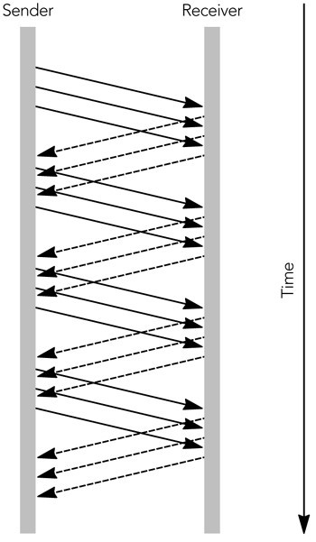
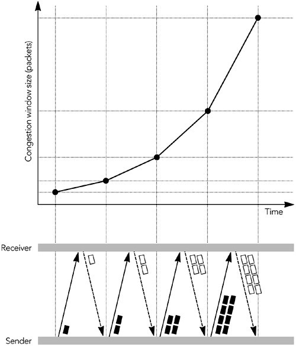
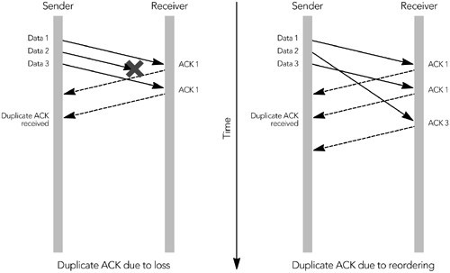
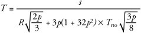
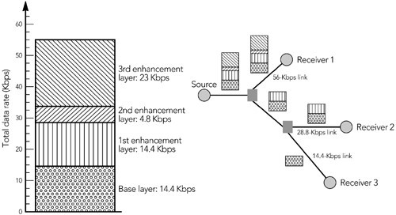
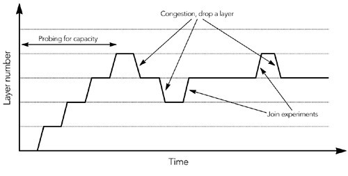

# 第10章.拥塞控制

- 拥塞控制的必要性
- 互联网的拥塞控制
- 对多媒体的影响
- 多媒体的拥塞控制

到目前为止，我们已经假设有可能以其自然码率发送媒体流，并且试图超过自然码率会导致数据包丢失，我们必须隐藏和纠正。然而，在现实世界中，我们的多媒体流很可能与其他流量共享网络。必须考虑我们对流量的影响，以及如何成为良好的网络公民。

## 拥塞控制的必要性

在讨论互联网上使用的拥塞控制机制及其对多媒体流量的影响之前，重要的是要了解什么是拥塞控制，为什么需要拥塞控制以及如果应用程序不受拥塞控制则会发生什么。

正如我们在第2章“通过分组网络进行语音和视频通信”中所讨论的那样，IP网络提供了尽力而为的分组交换服务。 这种网络的定义特征之一是没有准入控制。 网络层接受所有数据包，并尽最大努力交付它们。 但是，它不能保证传送，如果链路变得拥塞，它将丢弃多余的数据包。 只要高层协议注意数据包丢失并在发生拥塞时降低其发送码率，此方法就可以很好地工作。 如果不这样做，则可能会导致网络拥塞崩溃。

拥塞崩溃定义为网络负载的增加导致网络有效传输的数据包数量减少的情况。图10.1显示了这种效果，当超过拥塞崩溃阈值时，交付率会突然下降。当通过网络发送数据包在到达目的地之前就被丢弃(例如，由于中间节点的拥塞)而导致容量浪费时，拥塞崩溃就会发生。

**图10.1. 拥塞崩溃**

考虑一个源发送一个由于拥塞而被丢弃的包。然后，该源重新传输数据包，该数据包再次被丢弃。如果源继续重发数据包，而其他网络流保持不变，则此过程可以继续进行，而网络已完全占满，却没有发送任何有用的数据。这就是拥塞崩溃。如果源检测到拥塞的发生，并将其作为一个信号来降低其发送码率，从而使拥塞得到缓解，则可以避免这种情况。

拥塞崩溃不仅是一个理论问题。 在互联网的早期，TCP没有有效的拥塞控制算法，其结果是在1980年代中期多次出现网络范围内的拥塞崩溃。 为防止此类崩溃，Van Jacobson开发了机制，以增强TCP协议，这将在下一部分“互联网的拥塞控制”中进行介绍。

随着非拥塞控制的多媒体流量的增加，拥塞崩溃的可能性再次成为人们关注的焦点。人们提出了各种各样的机制，路由器可以检测那些对拥塞没有响应的流，并惩罚那些丢包率高于响应流的流。虽然这些机制目前还没有广泛部署，但将来可能会更积极地监督网络是否遵守拥塞控制的原则。

除了拥塞崩溃之外，采用拥塞控制还有另一个原因：公平。 在流之间共享网络容量的策略不是由IP定义的，而是由在其上运行的传输协议的拥塞控制算法定义的。 TCP所采用的模型是在所有流之间大致平均地共享可用容量。 使用不同拥塞控制算法的多媒体流会扰乱这种公平的资源共享，通常会损害TCP的性能（TCP会被更具侵略性的多媒体流量所挤压）。

尽管在某些情况下可能需要优先考虑多媒体流量，但尚不清楚多媒体流量是否始终比TCP流量更重要，并且是否应该始终获得更大的网络容量份额。 诸如差异化服务和集成服务/ RSVP之类的机制允许根据应用程序需求，以可控制的方式为某些流赋予优先级，而不是基于它们所采用的传输协议以无差别的方式。 但是，这些服务优先级分配机制并未在公共互联网上广泛部署。

## 互联网上的拥塞控制

互联网上的拥塞控制由IP之上分层的传输协议实现。 解释UDP的拥塞控制功能很简单——除非由UDP之上的应用程序实现，否则就没有——但是TCP有大量的拥塞控制算法。

TCP是滑动窗口协议的一个例子。源程序包括它发送的每个数据包的序列号，这些序列号在接收程序发出的ACK(确认)数据包中被回传。最简单的滑动窗口协议要求在发送下一个包之前立即确认每个包，如图10.2所示。这就是所谓的“停止-等待”协议，因为发送方必须等待确认后才能发送下一个数据包。显然，“停止-等待”协议提供了流控制，防止发送数据量超出接收能力，但这也影响了传输性能，特别是当RTT比较大的时候。

**图 10.2. 简单的停止等待协议**

使用较大的窗口允许在接收到ACK之前发送多个数据包。 每个TCP ACK数据包都包括一个接收方窗口，该窗口向源指示在任何时间可以接受多少个八位位组的数据，以及来自数据包的最高连续序列号。 允许源在接收到ACK之前发送足够的数据包以填充接收窗口。 随着ACK的出现，接收窗口随之滑动，从而允许发送更多数据。 此过程如图10.3所示，其中的窗口允许三个未完成的数据包。 与简单的停止等待协议相比，更大的接收窗口提高了性能。

**图 10.3. 使用滑动接收方窗口**

除了接收窗口之外，TCP发送方还实现拥塞窗口。 根据网络容量的估计来确定拥塞窗口的大小，并防止发送方使网络超载（即，它提供了拥塞控制）。 发送方可以随时发送足够的数据包，以填满拥塞窗口和接收窗口中的最小值。

拥塞窗口从一个数据包的大小开始。只要不发生丢包，它就会根据慢启动（slow start）算法或拥塞避免（congestion avoidance）算法增加拥塞窗口的数据包。新建连接最初使用慢启动算法，然后过渡到拥塞避免算法。

在慢启动模式下，拥塞窗口会随着每个接收到ACK的包的大小而增加。 结果，发送方逐渐建立起网络可以处理的全部码率，如图10.4所示。慢启动一直持续到丢失数据包或超过慢启动算法阈值为止。

**图10.4. TCP慢启动**

在拥塞避免模式中，拥塞窗口每往返时间增加一个数据包的大小（而不是每个ACK的大小）。 结果是拥塞窗口呈线性增长，从而增加了发送码率。 

TCP连接根据这两种算法之一提高其发送码率，直到丢失数据包为止。 数据包丢失表示已达到网络容量，并且发生了短暂的拥塞。 发送方可以通过两种方式检测拥塞：通过超时或通过接收三个重复ACK。

如果在发送数据之后很长一段时间内未收到ACK，则假定数据已丢失。这是一种超时情况：当接收窗口中的最后一个数据包丢失时，或者当出现阻止数据包到达其目的地的（临时）故障时，会发生这种情况。当超时发生时，发送方将慢启动阈值设置为正在传输的数据包数的一半或两个数据包，以较大者为准。然后，它将拥塞窗口设置为一个数据包的大小，并进入慢启动。当发送方进入拥塞避免模式时，慢启动过程继续，直到超过慢启动阈值。长时间超时将导致发送方放弃，从而断开连接。

发送方可以检测到拥塞的另一种方法是通过存在重复的ACK数据包，当数据包丢失或重新排序时就会发生（见图10.5）。 ACK数据包包含接收到的最高连续序列号，因此，如果数据包丢失，则后续的ACK数据包将包含丢失之前的序列号，直到重新传输丢失的数据包为止。 如果对数据包进行重新排序，也会生成重复的ACK，但是在这种情况下，当重新排序的数据包最终到达时，ACK序列将恢复正常。

**图10.5. 生成重复的ACK包**

如果发送方收到三个重复的ACK数据包，则假设由于拥塞而丢失了一个数据包。发送方通过将其拥塞窗口和慢启动阈值设置为正在传输的数据包数的一半或两个数据包（以较大者为准）来作出响应。然后，它重新传输丢失的数据包并进入拥塞避免模式。

这些算法的组合给出了TCP连接吞吐量，如图10.6中所示。特性是加性增加、乘性降低（AIMD，备注:当TCP发送方收到ACK，并且没有检测到丢包事件时，拥塞窗口加1；当TCP发送方检测到丢包事件后，拥塞窗口除以2。）锯齿模式，在短时间间隔内吞吐量的变化较大。 

**图10.6. TCP发送码率的变化**

吞吐量的这种快速变化实际上是使用TCP稳定的系统的关键行为。乘性降低确保了对拥塞的快速响应，防止拥塞崩溃；加性增加，探测最大可能吞吐量，确保充分利用了网络容量。

对TCP吞吐量的变化以及竞争TCP流的行为进行了大量的研究。这些研究表明，竞争流平均获得的容量份额大致相等，尽管锯齿状的吞吐量分布意味着它们对带宽的瞬时份额不太可能是公平的。

TCP中存在一种系统的不公平性：因为该算法响应反馈，所以往返时间较短的连接可以更快地返回反馈，因此效果更好。 因此，具有较长RTT的连接只能获得较低的平均份额。

## 对多媒体的影响

如第2章所述，通过分组网络的语音和视频通信，大部分流量（超过95%的八位组传输）使用TCP作为其传输协议。由于需要多媒体流量与网络上的其它流量和平共处，所以多媒体流量应该采用与TCP公平的拥塞控制算法。

正如我们所看到的，TCP在非常短的时间范围内适应网络拥塞，它为网络往返时间较短的连接提供了更高的网络带宽份额。此外，TCP的发展涉及到拥塞控制算法中的几个变体，每个算法的行为略有不同。这些因素使得TCP很难定义公平性：衡量公平的时间尺度是瞬时的还是长期的？远距离连接比本地连接带宽少是一个问题吗？在某些情况下，协议中影响行为的变化又如何呢？

进行的研究越多，TCP不完全公平这一点就越明显。在短期内，一个流总是会战胜另一个流。从长期来看，这些变化大部分都是平均的，除了具有较长往返时间的连接通常实现较低的平均吞吐量。TCP的不同变体也有一定的影响，例如，SACK-TCP通过一定的丢包模式获得更好的吞吐量。从长期来看，TCP最多只能达到2或3倍。

作为多媒体应用程序拥塞控制的设计者，TCP行为的变化实际上使我们的工作变得更容易。我们不必担心对任何特定类型的TCP完全公平，因为TCP本身并不完全公平。我们必须实施某种形式的拥塞控制--以避免拥塞崩溃的危险--但只要这对TCP大约是公平的，这就是可以预期的最佳结果。

有些人认为，多媒体应用程序不希望对TCP公平，而且这种业务占用的带宽超过其公平份额是可以接受的。毕竟，多媒体流量有严格的时序要求，而不像更具弹性的TCP流。在某种程度上，这一论点是有价值的，但重要的是要理解这种不公平可能产生的问题。

例如，考虑一个用户在收听在线广播电台的同时浏览Web。 在许多情况下，可能会争辩说正确的行为是使音频流比TCP流更具攻击性，从而从Web浏览器中窃取容量。结果是音乐不会跳帧，但Web下载的响应速度就会变慢。在许多情况下，这是期望的行为。类似地，在通过IP进行电话语音通话时发送电子邮件的用户通常更希望使电子邮件的传递速度更慢，而不是使音频中断。

但是，不能保证多媒体流量的优先级高于TCP通信。也许用户提交的网页是网上拍卖中的出价，或者是股票交易请求，对此立即采取行动至关重要。在这种情况下，如果在线无线电台延迟了TCP流量，用户可能会不高兴。

如果你的应用程序需要比正常通信更高的优先级，则应将此要求通知网络，而不是由特定的传输协议暗示。这种通信允许网络根据可用容量和用户的偏好在允许或拒绝更高优先级之间做出智能选择。RSVP/Integrated Services和differential Services等协议为此提供信令。在撰写本文时，对这些服务的支持非常有限；它们可以在一些专用网络上使用，但不能在公共互联网上使用。面向公共互联网的应用程序应考虑某种形式的TCP友好拥塞控制。

## 多媒体拥塞控制

在撰写本文时，还没有因特网上音频/视频流的拥塞控制标准。可以直接使用TCP，也可以模拟它的行为，正如下一节“类TCP码率控制”中所讨论的，尽管模拟TCP在实践中存在各种问题。IETF中也有一些工作正在进行，以定义一个TCP友好码率控制标准（参见标题为TCP友好码率控制的章节），该标准可能更适合单播多媒体应用。多播拥塞控制的最新技术还不太清楚，但是本章后面讨论的分层编码技术可能是最有希望的。

## 类TCP码率控制

音频/视频应用中最明显的拥塞控制技术是使用TCP或模拟TCP拥塞控制算法。

正如在第2章“分组网络上的语音和视频通信”中所讨论的那样，TCP具有一些不适合实时应用的特性，特别是强调可靠性而不是及时性。然而，一些多媒体应用程序确实使用TCP，并且定义了一个RTP over TCP封装，以便与RTSP（实时流协议）一起使用。

除了直接使用TCP，还可以在没有可靠性机制的情况下模拟TCP的拥塞控制算法。 尽管尚无标准，但已经进行了多次尝试来生成这样的协议，其中最完整的是Rejaie等人的码率自适应协议（RAP）。 与TCP非常相似，RAP源发送包含序列号的数据包，这些数据包被接收方确认。 使用来自接收方的确认反馈，发送方可以检测到丢包并保持往返时间的平滑平均值。

RAP发送方使用加法递增乘法递减（AIMD）算法来调整其传输码率，其方式与TCP发送方几乎相同，尽管由于它是基于码率的，因此它显示出比TCP更平滑的变化。与TCP不同，RAP中的拥塞控制与可靠性机制是分离的。当检测到丢包时，RAP发送方必须降低其传输码率，但没有义务重新发送丢失的包。实际上，最可能的响应是调整编解码器输出以匹配新的码率，并在不恢复丢包数据的情况下继续。

像RAP这样的协议，在某种程度上模拟TCP拥塞控制的行为，表现出对现有流量最公平的行为。 与标准TCP相比，它们还为应用程序提供了更大的灵活性，从而使它能够以所需的任何顺序或格式发送数据，而不会因为TCP所提供的可靠的顺序传递而受阻。

使用TCP或类似TCP的协议的缺点是，应用程序必须快速调整其发送码率，以匹配TCP流量的调整码率。它还必须遵循TCP的AIMD模型，这意味着码率的突然变化。对于大多数音频/视频应用程序来说，这是个问题，因为很少有编解码器能够在如此大的范围内快速适应，而且人们发现图像或声音质量的快速变化会干扰观看者。

这些问题并不一定意味着TCP或类似TCP的行为不适合所有音频/视频应用程序，而只是必须注意确定其适用性。这些拥塞控制算法的主要问题是隐含的码率快速变化。在某种程度上，你可以通过缓冲输出、隐藏码率的短期变化并将平滑的平均码率反馈给编解码器，使应用程序不受这些更改的影响。这对于非交互应用程序可以很好地工作，这些应用程序可以容忍缓冲所隐含的端到端延迟的增加，但不适合交互使用。

正在进行的协议研究将类似TCP的拥塞控制与不可靠的传输结合起来。如果发现其中一个适合与RTP一起使用，则可以扩展RTP以支持必要的反馈（例如，使用第9章“纠错”中描述的RTCP扩展）。设计合适的拥塞控制算法仍然是一个难点。

在撰写本文时，这些新协议都不完整。希望使用类似TCP的拥塞控制的应用程序可能最适合直接使用TCP。

## TCP友好码率控制

TCP或类似TCP的拥塞控制不适合交互式音频/视频传输的主要问题是在短时间内可能发生的大码率变化。许多音频编解码器是非自适应的，并且以单一固定码率（例如，GSM，G.711）工作，或者只能在固定码率集（例如，AMR）之间进行自适应。视频编解码器通常具有更大的码率适应范围，因为帧速率和压缩比都可以调整，但它们适应的码率通常较低。即使媒体编解码器能够快速适应，也不清楚这样做是否一定合适：研究表明，用户更喜欢稳定的质量，即使可变质量流具有更高的平均质量。

设计了各种TCP友好的码率控制算法，试图平滑发送码率的短期变化，从而使算法更适合音频/视频应用。这些算法在几秒的平均间隔内实现TCP的公平性，但在短期内可能不公平。它们在单播音频/视频应用中具有相当大的潜力，IETF正在定义一种标准机制。

TCP友好的码率控制是基于对由Padhye等人导出的TCP稳态响应函数的仿真。响应函数是TCP连接吞吐量的数学模型，是给定网络丢包率和往返时间的平均吞吐量的预测。响应函数的推导有点复杂，但Padhye已经表明，在稳定条件下，TCP连接的平均吞吐量T可以通过以下方式建模：

在这个公式中，s是以八位元为单位的数据包大小，R是发送方和接收方之间的往返时间(以秒为单位)，p是丢包事件率(与丢失数据包的分数不完全相同；参见下面的讨论)，而Trto是TCP重传超时时间(以秒为单位)。

这个方程看起来很复杂，但参数的测量相对简单。基于RTP的应用程序知道其发送的数据包的大小，可以从RTCP SR和RR包中的信息获得往返时间，并且在RTCP RR包中报告丢包事件率的近似。这只剩下TCP重传超时，Trto，令人满意的近似是往返时间的四倍，Trto＝4R。

在测量了这些参数之后，发送方可以计算在稳定状态下，即在假定丢包率恒定的情况下，TCP连接在类似网络路径上将达到的平均吞吐量（在几秒钟内的平均）。然后，这些数据可以用作拥塞控制方案的一部分。如果应用程序以高于TCP计算出的码率发送，则应降低传输码率以匹配计算值，否则可能会造成网络拥塞。如果它以较低的码率发送，它可以增加其码率以匹配TCP将达到的码率。应用程序运行一个反馈回路：改变传输码率、测量丢包事件码率、改变传输码率匹配、测量丢包事件码率，重复。对于使用RTP的应用程序，这个反馈循环可以由RTCP接收报告包的到达来驱动。这些报告导致应用程序重新评估并可能更改其发送码率，这将在下一个接收报告中测量效果。

例如，如果报告的往返时间为100毫秒，则应用程序正在发送带有20毫秒数据包（s = 200，包括RTP / UDP / IP标头）的PCM µ-law音频，丢包事件率为1％ （p = 0.01），TCP等效吞吐量将为T = 22,466个八位位组每秒（21.9 Kbps）。

因为这低于64千比特PCM音频流的实际数据码率，所以发送方知道这引起了拥塞，因此必须降低其传输码率。 它可以通过切换到较低码率的编解码器（例如GSM）来实现。
这似乎是一件简单的事情，但在实践中有一些问题需要解决。最关键的问题是如何测量和平均丢包率，但在包大小、慢启动和非连续传输方面存在次要问题：

- 最重要的问题是计算要反馈给发送方的丢包事件率的算法。RTP应用程序不直接测量丢包事件率，而是计算每个RTCP报告间隔中丢包的数量，并将该数量包含在RTCP接收报告包中作为丢包部分。对于TCP友好的码率控制算法来说，这是否是正确的度量还不清楚。

  丢包率可能不是一个足够的度量，原因有二：首先，TCP主要响应丢包事件，而不是实际丢失的数据包数量，大多数实现仅对一次往返时间内任何数量的丢包的响应定为将其拥塞窗口减半。将往返时间内连续丢失的多个数据包视为单个事件的丢包事件的度量，而不是将单个丢失的数据包计算在内，以与TCP更平等地竞争。丢包事件率可以通过RTCP接收方报告的扩展来报告，但目前还没有标准的解决方案。

  第二个原因是，在任何特定时间间隔内报告的丢包率不一定是潜在丢包率的反映，因为丢包率可能会因不具代表性的丢包突发而突然变化。这是一个问题，因为如果发送方使用丢包分数直接计算其发送码率，可能会导致振荡行为。在某种程度上，这种行为是不可避免的，AIMD算法本身是振荡的，但振荡应该尽可能减少。

  用于减少振荡的解决方案是在特定时间段内的平均丢包报告，但是研究人员对正确的平均算法没有明确的共识。SiSalem和Schulzrinne建议使用指数加权移动平均丢包分数，其优于原始丢包率，但在某些情况下仍可引起振荡。Handley等人建议使用丢包事件率的加权平均值，修改以排除最近的丢包事件，除非这将增加平均丢包事件率。该修改的加权平均值防止了孤立的、无代表性的丢包破坏了丢包估计，并因此减少了振荡的机会。

  虽然它不是最优的，但使用RTCP接收报告中所报告的丢包分数的指数加权移动平均来近似丢包事件率可能是足够的。其目标不是对TCP连接完全公平，而是在某种程度上公平，不造成拥塞，并且仍然可以用于音频/视频应用程序。一个更完整的实现将扩展RTCP接收报告，以直接返回丢包事件率。

- TCP友好的码率控制算法假设包大小s是固定的，而传输码率R是可变的。固定的s和可变的R在某些编解码器中很容易实现，但在其他编解码器中很难实现。编解码器变化对公平性的影响是一个正在进行的研究课题，它会影响包的大小和码率。

  同样，应用程序可能正在使用具有有限适应范围的编解码器，并且可能无法以TCP友好算法指定的码率发送。安全的解决方案是以下一个可能较低的码率发送；如果不可能降低码率，则可能必须停止传输。

- 如前所述，TCP在开始传输时实现一个慢启动算法。这种缓慢的启动允许发送方以渐进的方式探测网络容量，而不是从可能导致拥塞的突发开始。慢启动对于TCP来说实现起来很简单，因为在发生丢包时会有立即的反馈，但是对于以较长时间间隔发送反馈的基于码率的协议来说则更为困难。

  适用于TCP友好码率控制的解决方案是，在慢启动期间，接收方每往返一次就对接收码率发送反馈。发送方以低码率启动（建议每秒一个包），每次反馈包到达时将其传输码率加倍，直到检测到第一个丢失。丢包发生后，系统开始正常运行，从丢包发生前使用的码率开始。这会逐渐增加到一个“合理”的值，此时码率控制算法将接管该值。

  该解决方案适合于与RTP一起使用，其中接收方根据扩展的RTCP反馈配置文件发送确认(参见第9章《错误恢复》以及OTT等人2003)，并且发送方每往返时间将其码率加倍，直到发生丢包为止。然后，接收方回复到正常的RTCP操作，发送方遵循TCP友好的码率。

  一些应用程序可能无法执行此倍率算法，因为它们支持的编解码器集受到限制。此类应用程序可能会考虑先发送虚拟数据，然后在知道可持续传输码率后切换到最合适的编解码器。

- 最后一个问题是不连续传输。如果源停止发送一段时间，则不会收到有关正确码率的反馈。在暂停期间，可用容量可能会发生变化，可能是因为启动了另一个源，所以当发送方恢复时，上次使用的传输码率可能不合适。对于这个问题，除了可能从零开始或从另一个慢启动算法降低的码率开始，直到确定正确的码率为止，几乎没有办法解决这个问题。
  
  如果能够解决这些问题，TCP友好的码率控制就有可能成为单播音频/视频应用拥塞控制的标准方法。强烈建议所有单播RTP实现包括某种形式的TCP友好拥塞控制。

  实现至少应该观察RTCP RR包报告的丢包率，并将其发送码率与从该丢包率导出的TCP友好码率进行比较。如果实现发现其发送速度明显快于TCP友好码率，则应切换到较低码率的编解码器，或者在无法实现较低码率的情况下停止传输。这些措施可防止拥塞崩溃，并确保网络正常运行。

  实现TCP友好的码率控制算法将使应用程序优化其传输以匹配网络，给用户最好的质量。在此过程中，它还将公平对待其他流量，以免干扰用户正在运行的其他应用程序。如果应用程序有一个合适的编解码器或一组编解码器，强烈建议不仅使用码率控制来降低网络拥塞时的码率，而且要允许应用程序在网络负载较少时提高其质量。

## 分层编码

多播大大增加了拥塞控制的难度:发送方需要调整其传输以同时适应多个接收方，这个要求乍一看似乎是不可能的。多播的优点是，它允许发送方有效地向一组接收方传输相同的数据，而拥塞控制要求每个接收方获得适应其特定网络环境的媒体流。这两个要求似乎从根本上是互相矛盾的。

解决方案来自分层编码，在分层编码中，发送方将其传输分成多个多播组，而接收方只加入可用组的一个子集。拥塞控制的负担从无法满足每个接收者的冲突需求的源头转移到能够适应其具体情况的接收者身上。

分层编码需要一个媒体编解码器，能够将一个信号编码成多个层，这些层可以增量组合以提供逐渐提高的质量。一个只接收基本层的接收方将得到一个低保真度信号，一个接收基本层和一个附加层的接收方将得到更高的质量，每个附加层增加接收信号的保真度。除了基本层之外，层本身是不可用的：它们只是细化由较低层之和提供的信号。

分层编码的最简单用法是给每个接收方一个或多个层的静态订阅。例如，发送方可以生成如图10.7所示排列的层，其中基本层对应于14.4-Kbps调制解调器的容量，基本层和第一增强层的组合匹配于28.8-Kbps调制解调器的容量，基本层和前两个增强层的组合匹配于33.6-Kbps调制解调器，等等。每一层都是在一个单独的多播组上发送的，接收者加入适当的组集合，以便他们只接收感兴趣的层。网络中支持多播的路由器确保流量仅在指向感兴趣的接收方的链路上流动，从而将适应的负担放在接收方和网络上。

**图10.7. 分层编码**

> 相关解决方案涉及使用simulcast，其中发送方生成适合于不同码率的多个完整媒体流，接收方加入单个最适当的组。此解决方案在发送方使用了更多的带宽-可能的码率的和，而不是最高的可能码率，但实现更简单。它不能解决瞬时拥塞引起的问题，但对码率选择问题提供了良好的解决方案。

虽然层的静态分配通过调整媒体流以服务于多个接收方来解决码率选择问题，但它不响应由于交叉业务引起的瞬时拥塞。不过，很明显，允许接收者根据拥塞情况动态更改其层订阅可能为多播拥塞控制提供了一种解决方案。基本思想是让每个接收方运行一个简单的控制回路：

- 如果出现拥挤，则丢弃一层或多层。

- 如果有备用容量，则添加一层。

如果适当地选择了层，则接收方将搜索最优的层订阅，以与TCP源在慢启动阶段探测网络容量相同的方式更改其接收带宽。接收方连接层直到观察到拥塞，然后返回到较低的订阅级别。

要驱动自适应，接收方必须确定它们的订阅级别是太高还是太低。很容易检测到超额订阅，因为会发生拥塞，并且接收方会看到数据包丢失。订阅不足很难检测，因为没有信号表明网络可以支持更高的码率。相反，接收者必须尝试加入一个附加层，如果该层导致拥塞，则必须立即丢弃该层，这是一个称为连接实验的过程，结果如图10.8所示，订阅级别订阅级别根据网络拥塞而变化。

**图10.8. 通过改变订阅级别进行适配**

加入实验的困难在于试图实现共享学习。 考虑图10.9所示的网络，其中接收方R1执行加入实验，但R2和R3不执行。 如果源和R1之间的瓶颈链接是链接A，则一切将正常工作。 但是，如果瓶颈是链接B，则R1执行的连接实验将导致R2和R3出现拥塞，因为它们共享瓶颈链接的容量。 如果R2和R3不知道R1正在执行连接实验，则将拥塞视为丢弃层的信号-这不是期望的结果！

**图 10.9. 加入实验的难点**

还有第二个问题。如果链路C是瓶颈，而R2丢弃一层，则除非R3也丢弃一层，否则通过瓶颈的流量不会受到影响。因为R2仍然看到拥塞，它将丢弃另一层，这个过程将重复，直到R2厌恶地离开会话，或者R3也丢弃一层。

解决这两个问题的方法是同步接收方连接实验。如果每个接收方通知所有其他接收方它将加入或丢弃一个层，则可以实现此同步，但这样的通知很难实现。一个更好的解决方案是，发送方在数据流中包含同步点（特别标记的数据包），告知接收方何时执行连接实验。

其他问题与多播路由的操作有关。尽管多播连接速度很快，但处理丢弃请求通常需要一些时间。接收方必须留出处理丢弃请求的时间，然后才能将拥塞的持续存在视为丢弃附加层的信号。此外，快速连接或丢弃会导致大量的路由控制通信量，这可能是有问题的。

如果这些问题能够得到解决，并且为每一层选择适当的带宽，就有可能通过分层编码来实现TCP友好的拥塞控制。将这种拥塞控制应用于音频/视频应用程序的困难在于找到一种能够生成具有适当带宽的累积层的编解码器。

分层编码是最有前途的多播拥塞控制方案，它允许每个接收方选择合适的码率，而不必给发送方增加负担。IETF中的可靠多播传输工作组正在开发一个分层拥塞控制标准，这项工作很可能将成为未来多播音频/视频拥塞控制标准的基础。

## 总结

拥塞控制是必要的。作为一个应用程序设计人员，你可以忽略它，如果你这样做，你的应用程序甚至可能看起来工作得更好。但是，你可能会以相反的方式影响网络上的其他流量，或者你自己的应用程序的其他实例，并且你无法知道这些流量的相对重要性。出于这个原因，为了避免导致拥塞崩溃的可能性，应用程序应该实现某种形式的拥塞控制。我们还希望所选的算法对TCP流量近似公平，允许以控制的方式将不公平优先级引入到网络中。

拥塞控制的标准仍在发展中，因此很难为实现者提供详细的规范。尽管如此，强烈建议单播应用程序实现一个TCP友好的码率控制算法，因为这些是最好的开发。对于多播应用，拥塞控制的选择不是很明确，但分层编码似乎是目前最好的选择。
