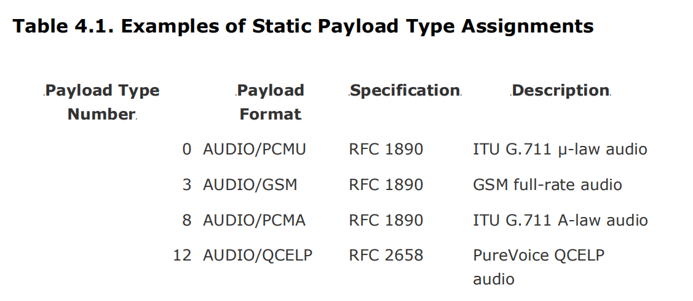
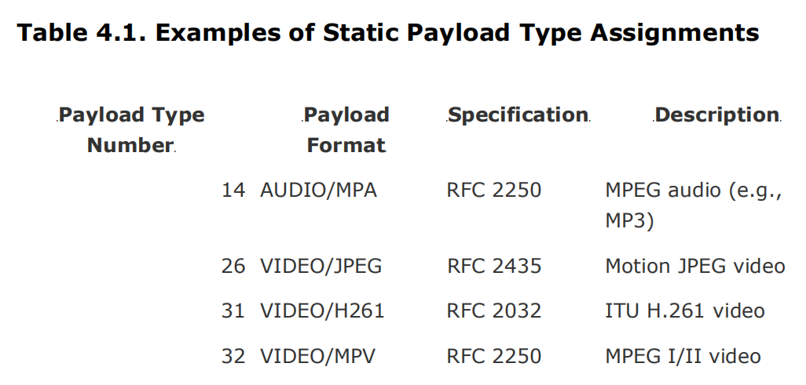
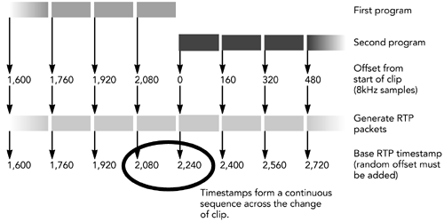

# 第四章 RTP数据传输协议

- RTP会话
- RTP数据传输包
- 包校验
- 转码和混流器

 本章介绍了RTP数据传输协议，即实时媒体交换的方法。讨论主要集中在RTP的“在线”方面，即数据包的格式和互动性要求。在后面的章节中将解释使用RTP的系统设计。

## RTP 会话

一个RTP会话包含一组参与者。一个参与者可能活跃于多路RTP会话，例如一路会话交换音频，另一路交换视频。每个参与者与一个IP端口二元组绑定发送的数据类型，标识哪些数据要从其接收。接收和发送数据的端口可能是一样的。每组端口对由相邻的两个端口组成：一个传输RTP包的偶数端和高一位传输RTCP的奇数端口。UDP/IP下的默认端口是5004和5005，但是很多应用在会话启动的时候动态申请端口，忽略默认端口，RTP会话被设计成只传输单一类型的媒体数据。多媒体通讯中，每一种媒体类型应该在独立的RTP会话中。

> RTP规范的最新修订放宽了RTP数据端口必须是偶数编号的要求，并允许不相邻的RTP和RTCP端口。通过此更改，可以在存在某些类型的网络地址转换（NAT）设备的环境中使用RTP。如果可能，为了与较早的实现兼容，即使不严格要求，使用相邻端口也是明智的。

会话可能是单播，活直接在两个参与者之间(P2P)，或发送到中心服务器，再由中心服务器重新转发。也可以多播面向一组参与者。会话也不是必须严格限制在一个地址空间。例如，RTP转换器可以桥接在多播和单播中，或者在IP网络或者其他网络之间，比如IPv6和ATM。后面的章节会讨论转换器的细节(转换器和混流器).

可能的会话使用的网络协议范围意味着，编写RTP终端系统，应该使其在本质上与底层传输无关。一种好的设计是将传输地址和端口的信息限制在你的底层网络代码，并使用RTP级别的机制进行参与者识别。 RTP为此提供了一个“同步源”，本章稍后将对此进行详细介绍。


​	**图 4.1 RTP 会话类型**

在实际应用中应注意：

- 不应使用传输地址作为参与者标识符，因为数据可能是从转换器或者合成器过来的，会隐藏原来的源地址。应该使用“同步源”标识.
- 不应该假定一个会话只有两个参与者，即使实在单播情况下。单播连接的另一端可以是RTP转换器或混流器，用作可能无限数量的其他参与者参与的网关。

优秀的设计会隐藏背后实际的参与者。

### RTP 数据传输包The RTP Data Transfer Packet

RTP 数据包的格式在图4.2 中进行了说明。数据包分为四个部分：

- 固定RTP头
- 可选的包头扩展
- 可选的有效负载头（取决于所使用的有效负载格式）
- 有效负载数据本身


通常RTP包由更底层的协议承载，例如UDP/IP.

### 包头

固定RTP包头的长度通常为12字节，如果包含贡献源列表，可以将长度扩展4至60个字节。固定包头中的字段：有效负载类型、序列号、时间戳和同步源标识符。另外，还有同步源计数，mark标记，填充和标题扩展标记，以及支持以及版本号。

#### 负载类型

RTP头部的负载类型（PT）与RTP传输的媒体数据关联。接收端应用检测负载类型来甄别如何处理数据，例如，传递给特定的解压缩器。有效负载字段的确切解释是由RTP配置文件定义的，该配置文件将有效负载类型编号绑定到有效负载格式规范，或者由非RTP方式定义。

许多音视频应用程序在RTP配置文件下以最小的控制（RFC 1890）运行。该配置文件（通常称为audio / video profile）定义了有效负载类型编号和有效负载格式规范之间的默认映射表。 Table 4.1中显示了这些静态分配的示例（这不是完整的列表；配置文件定义了其他分配）。除静态分配外，带外信令（例如，使用SIP，RTSP，SAP或H.323）可用于定义映射。使用音频/视频配置文件时，以这种方式为动态分配保留了96到127范围内的有效负载类型；其他配置文件可以指定不同的范围。

有效负载格式是根据MIME名称空间命名的。该名称空间最初是为电子邮件定义的，用于标识附件的内容，但此后它已成为媒体格式的通用名称空间，并在许多应用程序中使用。 MIME类型在RTP的使用相对较新-有效负载类型名称最初占用一个单独的名称空间-但它是一项强大的功能，为每种媒体类型提供了传输和编码选项的中央存储库。





所有有效负载格式都应该具有MIME类型注册。更新的有效负载格式将其包含在其各自规范中； 在线维护MIME类型的完整列表，网址为：http://www.iana.org/assignments/media-types.

无论负载类型是静态分配还是动态分配，都需要把会话告诉应用，使得应用知道是哪种负载类型。一种通用的方法是会话描述协议(SDP).下面是一段可能的文件描述：

```s
v=0
o=bloggs 2890844526 2890842807 IN IP4 10.45.1.82
s=-
e=j.bloggs@example.com(Joe Bloggs)
c=IN IP4 224.2.17.12/127
t=2873397496 2873404696
m=audio 49170 RTP/AVP 0
m=video 51372 RTP/AVP 98
a=rtpmap:98 H263-1998/90000
```

在我们对RTP的讨论中，需要关注的是 c = 和 m = 行（用于传递RTP会话的地址和端口并定义所使用的配置文件和有效负载类型）和 a = rtpmap：行（用于动态分配有效负载类型）。

该示例描述了两个RTP会话：音频通过生存时间127发送到端口49170上的IPv4多播组224.2.17.12，视频被发送到端口51372上的同一多播组。音频和视频都使用RTP / AVP作为他们的传输工具；这是使用RTP配置文件进行音频和视频会议的RTP传输，只需进行最少的控制。

用于音频的有效负载类型为0。这是配置文件静态分配的，即AUDIO/PCMU的有效负载格式。视频的有效负载类型为98，通过 a = rtpmap: 这一行,映射为VIDEO/H263-1998的有效负载格式。通过参考MIME类型分配表，我们发现VIDEO / H263-1998的定义在RFC 2429中。

尽管SDP是描述RTP会话的常用解决方案，但并不是所有的RTP内容都需要使用SDP。例如，基于ITU建议H.323的应用程序使用RTP进行媒体传输，但使用不同的机制（H.245）来描述会话。

> 对于有效负载类型编号向有效负载格式的映射，静态分配与动态分配之间的优缺点存在一些争议，这可能是由于音频/视频配置文件中的静态分配列表很长，而动态分配所需的信令又太复杂。
> 当RTP是新的并且使用简单的有效负载格式进行实验时，静态有效负载类型分配才有意义。接收端只能根据有效负载类型编号来解码RTP有效负载，因为编解码器不需要任何额外的配置，并且减少信令可以简化这些新应用程序的开发。
> 但是，随着设计人员获得了RTP的经验的增加，并将其应用于更复杂的有效负载格式，很明显，静态分配是有缺陷的。
> 当今使用的大多数有效负载格式，除了有效负载类型分配外还需要一些配置，这需要信令。 IP语音和视频点播等新兴应用需要信令来确定用户位置，身份验证和付款。因为无论如何都需要信令，所以静态有效负载类型分配的优点也失去了。
> 使用动态分配还可以避免由于有效负载类型空间耗尽而引起的问题。只有127种可能的静态分配，而可能的有效负载格式数量远远超过了该数量。动态分配仅允许将会话持续时间所需的那些格式绑定到有效负载类型编号。
> 因此，IETF音频/视频传输工作组的政策是不再进行更多的静态分配，应用程序可以用带外信令通知其有效负载类型使用情况。

RTP媒体时钟，以及任何有效负载头的格式和有效负载本身。对于静态分配，时钟速率在配置文件中指定； 动态分配必须指示时钟速率以及有效负载类型和有效负载格式之间的映射。例如，在上一个会话描述中，a = rtpmap：行指定了VIDEO / H263-1998有效负载格式为90,000-Hz时钟。大多数有效负载格式以有限的一组时钟速率运行，有效负载格式规范定义了哪些速率有效。

RTP会话不局限于使用单个有效负载格式。会话中可以使用多种有效负载格式，不同的格式由不同的有效负载类型标识。该格式可以在会话中的任何时间更改，并且只要预先通知了从有效负载类型到有效负载格式的映射，就无需在更改发生之前发出信号。一个示例可能是在IP语音会话中对DTMF音频进行编码，以支持自动服务的“按0与操作员通话”样式，其中一种格式用于语音，另一种格式用于人工会话。

尽管在会话中可以使用多种有效负载格式，有效负载类型却不是为多路复用不同类别的媒体准备的。例如，如果音频和视频都由应用程序发送，那么应将它们作为两个不同的RTP会话在不同的地址/端口上发送，而不是作为单个RTP会话发送再按有效负载类型进行多路分解。媒体的这种分离允许应用程序为不同的媒体要求不同的网络服务质量，并且它对于RTP控制协议的正确操作也是必需的。

#### **序列号SEQUENCE NUMBER** 

RTP序列号用于标识数据包，并在数据包丢失或乱序发送时向接收端发送标识。尽管它可以让接收端按发送顺序重新组织数据包，但它不用于安排数据包的播放顺序（这是时间戳的作用)。

序列号是一个无符号的16位整数，每个包+1，并在达到最大值时回绕为零。 16位空间的一个很重要的结果是序列号回绕相对频繁地发生：典型的VOIP应用程序以20毫秒的数据包发送音频，大约每20分钟就会回绕一次序列号。

这意味着应用程序不应依赖序列号作为唯一的数据包标识符。取而代之的是，建议使用扩展的序列号（32位或更宽）在内部标识数据包，低16位是RTP数据包中的序列号，高16位是该序列号回绕的次数的计数：

```C++
extended_seq_num = seq_num + (65536 * wrap_around_count) 
```

由于可能会丢失数据包或重新排序，因此在序列号回零时，保持回绕计数器（wrap-around-count）并不是增加计数那么简单。 RTP规范中用于维护回绕计数器的算法：

```c++
uint16_t udelta = seq – max_seq
if (udelta < max_dropout) {
  if (seq < max_seq) {
  wrap_around_count++
}
max_seq = seq;
} else if (udelta <= 65535 – max_misorder) {
  // The sequence number made a very large jump
  if (seq == bad_seq) {
    // Two sequential packets received; assume the
    // other side has restarted without telling us
    ...
  } else {
    bad_seq = seq + 1;
  }
} else {
// Duplicate or misordered packet
...
}
```

注意，所有计算均使用取模和16位无符号数进行。seq和max_seq都是RTP数据包中未扩展的序列号。 RTP规范建议max_misorder = 100，max_dropout = 3000。

如果扩展的序列号是在接收到数据包后立即计算并在之后使用的，则可以使大多数应用程序不知道序列号回绕。隐藏回卷的功能大大简化了丢包检测和隐藏、数据包重新排序以及统计信息的维护。除非数据包速率很高，否则32位序列号的回绕时间将使大多数应用程序可以忽略这种可能性。例如，前面给出的IP语音示例将花费两年多的时间来回绕扩展的序列号。

如果数据发包频率很高，则在应用程序运行时，可能会回绕32位扩展序列号。在此类环境中设计应用程序时，必须使用更大的扩展序列号（例如64位）来避免该问题，或者通过使用32位模运算对序列号执行所有计算来构建应用程序以处理回绕。序列号回绕期间的错误操作是一个常见问题，尤其是当数据包在回绕期间丢包或重新排序时。

序列号的初始值应随机选择，而不是从零开始。这个措施的目的是:对加密RTP的流进行已知的纯文本攻击更难。即使源未加密，随机初始序列号的使用也很重要，因为流可能会经过源不知道的加密转换器，并且在转换器中添加随机偏移也不是一件容易的事（因为序列号要在RTCP接收报告数据包中报告；请参见第五章，RTP控制协议）。一个常见的实现错误是假设序列号从零开始。接收端应该能够播放流，不管初始序列号如何（也需要此功能来处理后加入的流）。

序列号应始终是连续的序列，对于每个发送的数据包，序列号应增加一，并且永远不要向前或向后跳转（当然，回绕除外）。而不管媒体如何生成，此要求对有效负载格式的更改都是有效的，例如，当你将视频剪辑拼接在一起时（也许是为了插入广告），RTP序列号空间必须是连续的，并且不得在每个剪辑的开头重置它。这会对流媒体服务器的设计产生影响，因为它们不能依赖存储在媒体文件中的序列号，而必须动态生成序列号(这几话的理解是，不依赖媒体文件中的序列号，而对读的文件重新组包，重新生成序列号)。

序列号的主要用途是丢包检测。序列号空间中的间隔向接收端表明必须采取措施来恢复或隐藏丢包的数据。这在H第8章《错误隐藏》和第九章《错误恢复》中有更详细的讨论。

序列号的第二个用途是允许重新组织发送数据包的顺序。接收端不必关心这一点,因为许多有效负载格式允许以任意顺序解码数据包-但是在接收到数据包时按顺序对数据包进行排序可能会使丢包检测更加容易。播放缓冲算法的设计在第六章《媒体采集、播放和时序》中有更详细的讨论。

#### **TIMESTAMP** 时间戳

RTP Ttimestamp表示数据包中媒体数据的第一个8位字节的采样时刻，用于编排媒体数据的播出。时间戳是一个32位无符号整数，其增加速率与媒体类型相关，并在超过最大值时回绕为零。对于典型的视频编解码器，使用90kHz的时钟频率，相当于大约13个小时的回绕。对于8kHz音频，间隔大约为6天。

时间戳的初始值是随机选择的，而不是从零开始。与序列号一样，此预防措施旨在使对加密RTP流的已知纯文本攻击更加困难。即使源未加密，使用随机初始时间戳也很重要，因为流可能会通过源未知的加密转换器。一个常见的实现问题是假设时间戳从零开始。接收端应该能够播放流而不管初始时间戳如何，并准备处理回绕信号；因为时间戳记并非从零开始，所以可能随时发生回绕。

时间戳回绕是RTP正常操作，应由应用程序处理。使用扩展的时间戳记（比如可能64位值）可能会使大多数应用程序感受不到回绕。但是，不建议使用扩展时间戳，因为在当今的处理器上64位运算通常效率低下。

更好的设计使用32位模运算来执行所有时间戳计算。这种方法允许计算时间戳之间的差，前提是所比较的数据包都位于时间戳空间的同一半。

时间戳是从媒体时钟派生而来的，该媒体时钟必须以线性和单调的方式增加（当然，回绕除外），从而为每个RTP会话生成单调的时间轴。这与媒体流的生成方式无关。

可以使用一个示例来阐明时间戳增加方式的含义：当音频剪辑在单个RTP会话中拼接在一起时，RTP时间戳必须形成连续的序列，并且不得在每个剪辑的开头重置。这些要求在图4.3中进行了说明，该图表明RTP接收端无法从RTP包头中识别出已经发生更改。

当发生快进或快退操作时，也是这样的，时间戳记必须形成连续的序列，并且不能跳来跳去。这个要求在实时流协议（RTSP）的设计中很明显，该协议包括“正常播放时间”的概念，代表了流中的时间索引。由于必须保持RTP时间戳的连续性，因此RTSP服务器必须在seek操作期间在RTP时间戳和正常播放时间之间发送更新的映射。

RTP时间戳的连续性对流媒体服务器的设计有影响。服务器不能依赖存储在媒体文件中的时间戳（或序列号），而必须考虑到媒体内的seek操作以及RTP会话中已播放的任何先前数据的持续时间，即时生成它们。

对以线性和单调方式增加的媒体时钟的要求，并不一定意味着媒体数据的采样顺序就是其发送顺序。在生成媒体帧并由此获得其时间戳之后，可以在打包之前对它们进行重新排序。所以，即使序列号顺序得到维护，数据包也可能不按时间戳顺序发送。接收端必须重建时间戳顺序才能播放媒体。

MPEG视频就是一个例子，它既包含关键帧又包括从中预测的前向（P帧）和向后（B帧）预测的增量编码帧。当使用B帧时，它们是从后面的数据包中预测出来的，因此必须延迟并乱序发送。结果是RTP流将具有非单调递增的时间戳。另一个例子，交织以减少突丢包的影响（请参见第八章错误隐藏中标题为交织的部分）。在所有情况下，接收机都必须重构单个时间线以播放媒体。



​	**4.3 合并两个有序时间戳**

RTP数据包上的时间戳在每个回绕周期内不一定是唯一的。如果两个数据包包含来自同一采样时刻的数据，则它们将具有相同的时间戳。时间戳的重复通常发生在将大视频帧拆分为多个RTP数据包进行传输时（这些数据包将具有不同的序号，但具有相同的时间戳）。

用于生成时间戳的媒体时钟的标称频率，由使用中的配置文件或有效负载格式定义。对于具有静态有效负载类型分配的有效负载格式，使用静态有效负载类型时时钟频率是隐式的（指定为有效负载类型分配的一部分）。动态分配过程必须指定频率以及有效负载类型（请参阅本章前面的标题为Payload Type的部分）。选择的速率必须满足所需的精度执行音视频同步并度量网络传输时间的变化。时钟频率可能不会任意选择；大多数有效负载格式定义一个或多个可接受的速率。

音频有效负载格式通常使用采样率作为其媒体时钟，因此，每次读取完整的样本时，时钟将增加一。有两个例外：MPEG音频使用90kHz时钟以与非RTP MPEG传输兼容。 G.722是16kHz语音编解码器，它使用8kHz媒体时钟来向后兼容RFC 1890，后者错误地指定了8kHz而不是16kHz。

视频有效负载格式通常使用90kHz时钟，以与MPEG兼容，因为这样做会产生典型的24Hz，25Hz，29.97Hz和30Hz帧频以及50Hz，59.94Hz和60Hz场频的整数时间戳增量。 。示例包括PAL（相位交替线）和NTSC（国家电视标准委员会）电视，以及HDTV（高清晰度电视）格式。

需要记住的重要的一点是，RTP不能保证媒体时钟的刻度，准确性或稳定性，这些属性被认为与应用有关，并且不在RTP的范围之内。通常，已知的只是其标称频率。除非应用程序有相反的特定知识，否则应用程序应该能够应对发送端和接收端媒体时钟的变化。

> 在某些情况下，可以定义媒体时钟的刻度，准确性和稳定性，并使用此知识来简化应用程序设计。通常只有在单个实体同时控制发送端和接收端，或者两者都针对具有严格时钟规范的配置文件时，才有可能。

接收端根据时间戳重建媒体流的正确时序的过程在第六章《媒体采集、播放和时序》中进行了描述。

#### **同步源 SYNCHRONIZATION SOURCE**  

synchronization source（SSRC）标识RTP会话中的参与者。它是一个临时的，每个会话的标识符通过RTP控制协议映射到一个长期的规范名称CNAME（请参阅第五章RTP控制协议标题为RTCP SDES：Source Description的部分）。

SSRC是一个32位整数，由参与者加入会话时随机选择。选择了SSRC标识符后，参与者就可以在发送的数据包中使用它。由于SSRC值是在本地选择的，因此两个参与者可能会选择相同的值。当一个应用程序发现从另一个应用程序收到的数据包包含为其自身选择的SSRC标识符时，可以检测到此类冲突。

如果某个参与者检测到当前使用的SSRC与另一参与者选择的SSRC之间发生冲突，则它必须向原始SSRC发送RTCP BYE（请参阅第五章RTP控制协议标题为RTCP BYE：Membership Control的部分）并选择另一个SSRC。这种冲突检测机制可确保SSRC对于会话中的每个参与者都是唯一的。

重要的是，使用高质量的随机源来生成SSRC，并实现冲突检测。特别是，随机数生成器的种子不应基于会话加入的时间或会话的传输地址，因为如果多个参与者同时加入，则会导致冲突。

具有相同SSRC的所有数据包均构成单个时序和序列号空间的一部分，因此接收端必须按SSRC对数据包进行分组才能进行播放。如果参加者在一个RTP会话中生成多个流（例如，来自不同的摄像机），每个流都必须标识为不同的SSRC，以便接收端可以区分哪些数据包属于每个流。

#### **贡献源 CONTRIBUTING SOURCES**  

在正常情况下，RTP数据由单个源生成，但是当多个RTP流通过混流器或转换器时，多个数据源可能对RTP数据包有所贡献。 贡献源（CSRC）列表标识了对RTP数据包做出了贡献的参与者但不负责其时序和同步。每个贡献源标识符都是一个32位整数，对应于对该数据包做出贡献的参与者的SSRC。 CSRC列表的长度由RTP包头中的CC字段标识。

包含CSRC列表的数据包是通过RTP混流器的操作生成的，如本章后面的“ Mixers”部分所述。当接收到包含CSRC列表的数据包时，SSRC将以常规方式将数据包分组以进行播放，并将每个CSRC添加到已知参与者列表中。由CSRC标识的每个参与者将具有相应的RTP控制协议数据包流，从而提供对参与者的完整标识。

**标记 MARKER** 

RTP包头中的 marker(M) 位用于标记媒体流中的关注事件；它的确切含义由所使用的RTP配置文件和媒体类型定义。

对于在RTP以最小的控制配置文件下在音频和视频会议下运行的音频流，标记位设置为1，表示在一段静默期后发送的第一个数据包，否则设置为0。将标记位设置为1可以告诉应用程序，这可能是调整播放点的好时机，因为听众通常不会注意到静音期长度的微小变化（而播放音频时播放点的变化是可以听见的）。

对于在RTP配置文件，在音频和视频会议中运行的视频流，标记位设置为1以标识视频帧的最后一个数据包，否则设置为0。如果设置为1，则该标记用作应用程序可以开始解码该帧的提示，而不是等待下一个具有不同时间戳的数据包来检测应显示该帧。

在任何情况下，标记位仅向应用程序提供提示，即使具有标记集的数据包丢失，程序也必须正常运行。对于音频流，因为静默期结束时序列号和时间戳之间的关系会发生变化，可以通过这个感知到其结束。可以通过观察时间戳的变化来检测视频帧的开始。如果包含标记位的数据包丢失，则应用程序可能会使用这些手段观察，但是程序性能降低。

RTP配置文件可以指定其他标记位，但以较小的有效负载类型字段为代价。例如，配置文件可以要求两个标记位和一个六位有效负载类型。当前没有任何配置文件使用此功能。

#### 填充 PADDING

RTP包头中的padding（P）位用于标识有效负载已被填充超过其自然长度。如果将填充添加到RTP数据包，则设置P位，并用填充字节的计数填充有效负载的最后一个字节。填充很少使用，但是对于某些与特定块大小配合使用，并使有效负载格式适应固定容量信道的加密方案来说，填充是必需的。

作为填充的使用示例，图4.4U显示了以RTP打包的GSM音频帧，该帧已从其自然长度45个八位字节（GSM帧为33个，RTP头为12个）的自然长度填充为48个八位字节。如果使用数据加密标准（DES）对数据包进行加密，则需要填充数据，因为DES需要8个字节（64位）的块。


#### 版本号 VERSION NUMBER

每个RTP数据包都包含一个版本号，由V字段表示。 RTP的当前版本定义了其他版本号，但RTP的版本号并未得到广泛使用。版本号字段的唯一有意义的用途是作数据包有效性检查。

#### 头扩展 Header Extensions 

RTP允许这样一种可能性，即扩展位包头（由X位设置为1表示）出现在固定RTP包头之后，但在任何有效负载包头和有效负载本身之前。扩展头的长度是可变的，但它们以16位类型字段开头，后跟16位长度字段（该字段以八位字节为单位计算扩展的长度，不包括起始的32位），如果接收端不能解析扩展头可以忽略。

扩展包头用于需要比固定RTP包头提供更多包头信息的情况。它们很少使用。需要额外的、与有效负载格式无关的头信息的扩展最好更新的RTP配置文件。如果特定的有效负载格式需要其他包头，它们不应使用扩展头，而应在数据包的有效负载部分中作为有效负载包头传输。

尽管头扩展名极为罕见，但是为程序的健壮性考量，可以通过忽略扩展头来处理无法识别的包头扩展。

#### 负载头 Payload Headers  

强制性RTP包头提供了所有有效负载格式所共有的信息。在许多情况下，有效负载格式将需要更多信息以实现最佳操作；该信息形成一个附加的头，该头被定义为有效负载格式规范的一部分。有效负载包头在固定包头、CSRC列表和包头扩展之后的RTP数据包中。有效负载头的定义通常构成有效负载格式规范的大部分。

有效负载头中包含的信息可以是静态的（对于使用特定有效负载格式的每个会话都相同），也可以是动态的。有效负载格式规范将指示有效负载头的哪些部分是静态的，哪些是动态的，并且必须在每个会话的基础上进行配置。那些动态的部分通常通过SDP进行配置，其中a = fmtp属性用于定义“格式参数”，尽管有时会使用其他方式。但是可以指定的参数分为三类：

1.影响有效负载包头格式的信息，这些信息指示包头字段的存在与否，其大小和格式。例如，某些有效负载格式具有几种操作模式，使用它们可能需要不同的头字段。

2.不影响有效负载包头格式但定义了各种包头字段的用法。例如，某些有效负载格式定义了交织的使用，并要求头字段指示交织序列内的位置。

3.代替有效负载头而影响有效负载格式的变量。例如，参数可以指定音频编解码器的帧大小或视频帧率。

有效负载格式在会话期间不会改变的特征，通常会由带外发出信号，而不是包含在有效负载头中。这减少了会话期间的开销，但以额外的信令复杂度为代价。语法和格式参数的使用通常被指定为有效负载格式规范的一部分。

指定有效负载头的主要原因是为那些不是设计用于有损数据包网络的格式提供错误恢复能力。第一个示例是RFC 2032和RFC 2736中讨论的H.261视频的有效负载格式。 在第8章《错误隐藏》和第9章《错误恢复》中进一步讨论了容错的问题。

> 用于H.261视频的RTP有效负载格式在设计上提供了有趣的教训，以提高错误恢复能力。 H.261编解码器允许视频块组的最大长度为3 KB。有效负载格式的原始版本规定，每组块都应直接插入RTP数据包中，或者如果太大，则应在数据包之间任意拆分。然而，这种方法留下了这样一种情况，包到达接收端并且必须被丢弃，因为先前的包丢失了，部分块组不能独立地被解码。这是我们要避免的丢包乘数效应。
> 实际上，块组不是H.261视频中的最小单位。有一些较小的单元，称为macro-blocks，但是如果不从块组的开始进行解析就无法识别它们。然而，在每个包的开始处包括附加信息就可以恢复通常从块组的开始进行解析而找到的信息。此技术用于定义有效负载格式，如果该有效负载超出了网络MTU，则会在宏块边界上拆分H.261流。
> 对于H.261，这不太明显，但确实意味着智能解码器可以从丢失的RTP数据包流中重建有效的H.261视频，而不必丢弃任何已经到达的数据。它显示了有效负载格式的容错设计的优势。

#### 有效负载数据

直接在任何有效负载包头之后的一帧或多帧媒体有效负载数据构成RTP数据包的最后部分（除了填充，如果有的话）。有效负载数据的大小和格式取决于会话建立期间选择的有效负载格式和格式参数。

许多有效负载格式允许在每个数据包中包含多个数据帧。接收端可以通过两种方式确定存在多少帧：

1.在许多情况下，帧的大小是固定的，可以通过检查数据包的大小来确定存在的数目。

2.其他有效负载格式在每个封装的帧中包括一个标识符，该标识符指示帧的大小。应用程序需要解析封装的帧，以确定帧的数量及其起点。当帧长是可变大小时，通常是这种情况。

通常，对可包含的帧数没有限制。预计接收端将处理各种大小的数据包：音视频配置文件中的准则建议，以帧大小的倍数为单位，最多200毫秒的音频，而视频编解码器应同时处理分片帧和完整帧。

选择每个数据包中要包括的有效负载数据量时，要考虑两个关键问题：将要遍历的网络路径的最大传输单位（MTU），以及等待更多数据来填充一个长包产生的延迟。

超出MTU的数据包将被分段或丢弃。如果丢弃超大数据包，显然是不希望看到的。由分片引起的问题不太明显。如果所有分片都到达，则分片的数据包将在接收端处重新组合。如果丢失任何片段，则即使正确接收了一部分数据包，也必须丢弃整个数据包。结果是丢包乘法效应，如果分组的大小适当，并且有效负载格式被设计为使得每个分组可以被独立地解码（如关于payload头所讨论的），则可以避免这种丢包。

延迟是另一个需要考虑的问题，因为只有在生成将要包含的数据的最后一个字节之后才能发送数据包。数据包开始处的数据会延迟到完整的数据包准备就绪为止。在许多应用程序中，与MTU相比，延迟问题在应用程序上提供了更严格的约束。

### **包校验 Packet Validation**  

由于RTP会话通常使用动态协商的端口对，因此验证接收到的数据包确实是RTP而不是其他数据尤为重要。乍一看，确认这一事实并非易事，因为RTP数据包不包含显式协议标识符；然而，通过观察多个数据包的包头字段，我们可以快速获得验证RTP流有效性的信心。

RTP规范的附录A中列出了可以对RTP数据包流执行的有效性检查。有两种类型的测试：

1.基于包头字段的固定已知值进行Per-packet checking，例如，版本号不等于2的数据包无效，有效负载类型不对的数据包也无效。

2.基于包头字段中的模式的Per-flowchecking。例如，如果SSRC恒定，并且每个接收到的数据包序列号加1，并且时间戳间隔适用于有效负载类型，那么几乎可以肯定这是RTP流，而不是流向错误的流。

流检查更有可能检测到无效数据包，但它们需要将其他状态保留在接收端中。有效源需要这些状态，但必须小心，因为保持过多状态以检测无效源可能导致拒绝服务攻击，在这种攻击中，恶意源向接收端发送大量的虚假数据包，会用尽资源。

一个可靠的实现将使用强大的Per-packet checking来清除掉尽可能多的无效数据包，然后再将资源提交Per-flowchecking检测其他数据包。它还应准备好主动丢弃状态疑似虚假的源，以减轻拒绝服务攻击的影响。

此外，还可以利用相应的RTCP控制包验证RTP数据流的内容。为此，应用程序丢弃RTP包，直到收到具有相同SSRC的RTCP源描述包为止。这是一个非常强大的有效性检查，但是会导致显着的验证延迟，尤其是在大型会话中（因为RTCP报告间隔可能是几秒钟）。因此，我们建议应用程序直接验证RTP数据流，使用RTCP作为确认而不是主要的验证方 法。

### 转换器和混流器

除了普通的终端系统，RTP还支持可在会话中的媒体流上运行的中间件。定义了两类中间件：转换器和混流器。

#### 转换器 

转换器是在RTP数据上运行，同时保持流的同步源和时间轴的中间系统。例如：在媒体编码格式之间进行转换而不进行混合，在不同的传输协议之间桥接、添加或删除加密或过滤媒体流的系统。除非RTP终端系统具有未转换媒体的先验知识，否则转换器对RTP终端系统透明。有几类转换器：

•Bridges。桥接器是一对一的转换器，不会更改媒体编码，例如，不同传输协议之间的网关，例如RTP / UDP / IP和RTP / ATM，或RTP / UDP / IPv4和RTP / UDP / IPv6。桥接器是最简单的转换器类，通常它们不会对RTP或RTCP数据造成任何影响。

•Transcoders。转码器是一对一的转换器，它们可以更改媒体编码（例如，解码压缩数据并以不同的有效负载格式对其重新编码），以更好地适应输出网络的特性。有效负载类型通常会更改，填充也会更改，但其他RTP包头字段通常保持不变。这些转换需要保持状态，以便可以调整RTCP发送端报告以使其匹配，因为它们包含源比特率的计数。

•Exploders。Exploders是一对多转换器，它们接收单个数据包并产生多个数据包。例如，Exploders接收一个流，其中每个RTP数据包中包括多个编解码器输出帧，Exploders生成包含单个帧的数据包，生成的数据包具有相同的SSRC，但其他RTP包头字段可能必须更改，具体取决于转换。这些转换需要维持双向状态：转换器必须调整RTCP发送端报告和返回的接收端报告以匹配。

•Mergers。Mergers是多对一转换器，将多个数据包合并为一个。这是上一类别的反面，并且存在相同的问题。
转换器的定义特征是每个输入流都产生具有相同SSRC的单个输出流。转换器本身不是RTP会话的参与者，它没有SSRC且本身不生成RTCP，并且其他参与者不可见。

#### 混流器 Mixer

mixer 是一个中间系统，它从一组源中接收RTP数据包并将其组合为单个输出，在转发结果之前可能会更改编码。例如：音频混合平台或视频画中画设备等网络设备。

因为输入流的时序通常不同步，所以混流器将不得不在合并它们之前进行调整以使媒体同步，因此它成为输出媒体流的同步源。混流器可以对每个到达的媒体流使用播出缓冲器，以帮助维持流之间的定时关系。混频器具有自己的SSRC，它将其插入自己生成的数据包中。来自输入数据包的SSRC标识符被复制到输出包的CSRC列表中。

混流器具有会话的唯一视图：它将所有源视为同步源，而其他参与者则看到一些同步源和一些贡献源。例如，在图4.5中，参与者X从三个同步源（Y，Z和M）接收数据，而A和B在来自M的混合数据包中贡献源。参与者A将B和M视为同步源，X、Y和Z是M的贡献源。混流器为会话的每一半分别生成RTCP发送端和接收端报告，并且不在各自之间转发它们。它转发RTCP源描述和BYE数据包，以便可以识别所有参与者（在第五章，RTP控制协议中讨论了RTCP）。

图4.5。混频器M将所有源视为同步源。其他参与者（A，B，X，Y和Z）则看到了同步源和贡献源的组合。
混流器不需要在会话的每半部分使用相同的SSRC，但是它必须将RTCP源描述和BYE数据包发送到两个会话的所有SSRC标识符。否则，一半的参与者不会知道SSRC正在另一半使用，他们可能会与之发生冲突。

跟踪转换器或混流器每一侧上存在哪些源非常重要


当错误的配置产生了环路时（例如，如果两个转换器或混流器并行连接，则将数据包循环转发）。如果检测到循环，则转换器或混流器应停止操作，并记录尽可能多的诊断信息。循环数据包的源IP地址最有用，因为它标识了导致循环的主机。

### 总结

本章已经详细描述了RTP数据传输协议在审议中的主要内容。我们考虑了RTP包头的格式及其用途，包括用于标识数据格式的有效负载类型，用于检测丢包的序列号，用于显示何时播放数据的时间戳以及作为参与者标识符的同步源。我们还讨论了次要的包头字段：标记，填充和版本号。

有效负载格式的概念及其到有效负载类型标识符和有效负载包头的映射现在应该很明显了，显示了RTP是如何针对不同类型的媒体量身定制的。这是一个重要的主题，我们将在后面的章节中讨论。
最后，我们讨论了RTP转换器和混流器：以受控方式扩展RTP范围的中间系统，允许会话桥接网络的异构性。
与RTP数据传输协议相关的是控制通道RTCP，本章已多次提及。下一章将更深入地讨论此控制信道，从而完成我们对RTP网络方面的讨论。