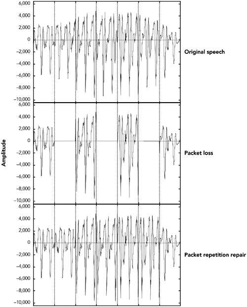
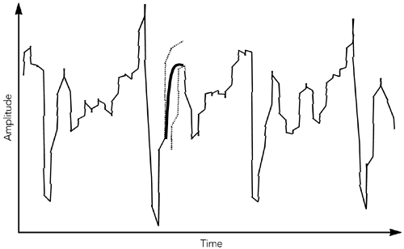
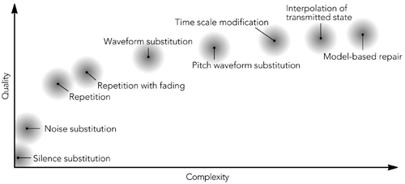
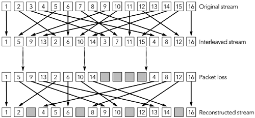
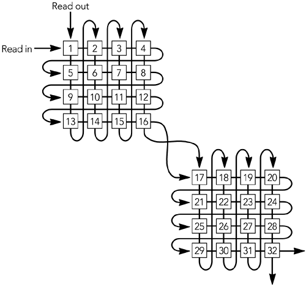

# 第八章 错误隐藏

- 音频丢包隐藏技术
- 视频丢包隐藏技术
- 交织

前几章描述了运行在 UDP/IP 上的 RTP 如何提供不可靠的数据包传输服务，以及这意味着应用程序可能必须要处理不完整的媒体流。当发生丢包时应用程序有两件事可以做：尝试恢复错误或尝试隐藏错误。错误恢复将在第 9 章讨论。本章我们将讨论接收端隐藏丢包影响的技术。

## 音频丢包隐藏技术

当包含音频数据（无论是音乐还是语音）的 RTP 数据包丢失时，接收端必须生成替换内容以保留媒体流的时序。这可以通过多种方式完成，在丢包的情况下，隐藏算法的选择会极大的影响对系统质量的感知。

### 测量音频质量

人类对声音的感知是一个复杂的过程，失真感知的显著性不仅取决于信号发生变化的量，还取决于损伤的类型，以及损伤在信号中的位置。有些类型的失真对听者比其他类型的失真更容易被察觉，即使通过某种客观的衡量，人们也没法发现这种区别。对于不同的听者，对于特定的音频损失的感知也是不一样的，并且不同的对不同的音频材料的感知也不一样。

这使得很难为不同的修复方案设计客观的质量评测。由于感知到的质量与波形差异没有直接关系，因此测量原始波形与接收端恢复的波形之间的差异是不够的。简单的方法如信噪比实际上也是无用的 。更复杂的方案（例如，国际电联建议 P.861 和 P.862 63,64) 提供的结果大致上是正确的，但即使是这样也不是 100%可靠的

当客观测量失败时，我们需要借助于主观测试。通过对各种各样的主题、材料和错误情况做听力测试，我们可以从对听众对音频损失的感知度 ，衡量不同修复方案的有效性。这些测试里播放不同类型的音乐，或收听不同错误条件和隐藏技术的下，一系列单词、短语和句子，并且听众根据特定的等级对它们的质量和或清晰度进行评估。

材料和评定尺度的选择取决于所测量的内容。如果你尝试测量语音的感知质量（“听起来不错吗？”），则基于平均意见得分（MOS）对样本进行评级是合适的。 MOS 是五分制的评分标准，其结果转换成数字形式（优异= 5，良好= 4，一般= 3，不良= 2，差= 1），并且取所有参与者的平均，给出一个介于 1 和 5 之间的数字作为结果。为使结果在统计上有效，需要进行大量的测试，比较不同的样本。

对于 G.711 编解码器（即标准电话质量），无障碍语音的典型 MOS 得分为 4.2，而对于移动电话（例如 GSM，QCELP），得分为 3.5 至 4。丢包会降低MOS得分，丢包程度和隐藏类型决定实际结果 。

MOS 评分提供了一种合理的感知质量测量，允许在不同的编解码器和修复技术之间进行比较，但它们并不测量可理解性（即音频是否可以理解）。听起来好和传达信息是有区别的；可以定义一种隐藏方案，它能获得很好的音质分数，但这个方案可能无法产生可理解的语音。在可理解性测试中，收听者抄下不同缺陷的句子或单词，或在一段课文上回答问题，结果是测量出现了多少错误。同样，必须进行大量的测试才能使统计的结果有意义。

或许从听力测试中学到的最重要的一点是，测试结果因听者、材料、失真类型以及测试内容而异。具体情况下，保证测试材料，丢包类型以及恢复方式相匹配，对知质量和可懂度两方面的测试很重要。

### 静音替换

最简单的修复技术是静音替换，在这种技术中，数据包丢失所造成的空白被适当时间范围内持续的的静音填充，如图 8.1 所示。这是成本最低，最容易实现的方法，也是最常用的技术之一。

图 8.1 使用静音替换进行修复（改编自 C. Perkins，O.Hodson 和 V. Hardman，“流媒体的丢包恢复技术概述”，IEEE 网络杂志，1998 年 9 月/十月。1998IEEE。）


不幸的是，静音替换也是最糟糕的修复方案，在用于评估修复质量的听力测试中一直被评为最后一个。H听力实验表明，只有短时间的数据包( < 16毫秒)和较低的丢包率( < 2 % )，静音替换才有效。随着分组大小和丢包率的增加，性能迅速下降。语音IP应用， 随着分组变大和网络丢包率的变化，性能迅速变得不可用

接下来介绍的任何一种技术都可以提供质量更高的声音，只要稍微增加一点点复杂性。

### 噪声替换

由于已证明静音替代的性能较差，因此下一个选择是用某种类型的背景噪声填充丢失的数据包所留下的间隙，这一过程被称为噪声替换。如图 8.2 所示。


简单地说，噪声替换就是用与前一个包波形匹配的白噪声（在所有频率上波形一致的噪声）代替丢失的信号。下面是它的伪代码实现。

```c++
void substitute_noise(sample previous_frame[samples_per_frame],
sample missing_frame[samples_per_frame)
{
  double energy;
  // Calculate energy (amplitude) of the previous frame
  energy = 0.0;
  for(j = 0; j < samples_per_frame; j++) {
   energy += previous_frame[j] * previous_frame[j];
  }
  energy = sqrt(energy);
  // Fill in the noise
 for(j = 0; j < samples_per_frame; j++) {
 missing_frame[j] = energy * random(-1,1);
}
```

请注意，真正的实现将很可能用接收到的最后几帧的旋转缓冲区来替换，在播放后丢弃旧的帧 。

语音听力测试表明，与静音替代相比，使用与信号幅度大致相同的白噪声替代，在主观上提供了更好的质量，和更好的清晰度。这在质量上的改善有一个基础：研究表明，语音的恢复，即人类大脑潜意识地有用正确的声音修复缺失的语音片段的能力，噪音修复语音时，但是静音来修复不会存在这种情形。由于白噪声几乎和静音一样容易产生，所以建议用它代替静音替换。

如果信号的频谱特性已知，就可以对产生的噪声进行调整，使其比白噪声更接近原始噪声。许多有效负载格式通过提供舒适的噪声包来简化这项工作，这些数据包将在静默期间发送。对舒适噪音的支持允许接收端在没有其他声音的情况下播放适当形式的背景噪声，这样看起来更自然。

对于不支持舒适噪声有效负载格式的，有一种标准的舒适噪声有效负载格式可用于传输此信息（默认音频/视频 profile 中的静态有效负载类型为 13)。这种舒适的噪声格式传达了两个信息：噪声的幅度和频谱参数。波形允许接收端产生幅度匹配的噪声；频谱参数使噪声的波形能够与周围的信号相匹配。

### 重复

根据音频信号的内容，可以提供一个类似于丢失包的替换包。这尤其适用于语音信号，这些语音信号遍布着重复的模式，称为音调周期，通常持续 20 毫秒到 100 毫秒。

图 8.3 展示出了典型的语音信号，虽然可以识别出许多特征，但主要是有声和无声的区别。声音由声带的周期性打开和闭合产生的，声带产生规则的、高振幅的音调周期，频率在 50Hz 到 400Hz 的近似范围内。有声部分通常持续几十甚至几百毫秒，所以允许用前面的数据包代替一个丢失的语音包，从而高效地修复语音丢包的问题。图 8.4 将反映这种现象。图中展示了通过重复包修复丢失包后除了修复区域的边缘是尖锐不连续以外，其余部分和最开始的状态几乎一样。


图 8.4 通过重复包修复语音



由 s、f、sh 等音组成的无声语音是由空气通过声带的压缩而产生的，它与低振幅噪声非常相似。同样，用前一个数据包的内容替换一段丢失的无声语音，可以产生相当好的修复效果。

当间隙很小时，重复效果最好，因为在间隙小时信号的特征很可能是相似的。通过逐渐减弱重复信号，可以提高具有较长时间间隙的表现。例如，GSM 移动电话系统建议对第一个丢失的数据包执行相同的重复，然后在接下来的 16 个分组 (320 毫秒总持续时间）内逐渐衰减到零振幅，或者直到接收到下一个包为止。

重复算法可以用伪代码来描述，如下所示：

```c++
void repeat_and_fade_frame(sample previous_frame[samples_per_frame], sample missing_frame[samples_per_frame],
 int consecutive_lost)
{
   // Repeat previous frame
   for (j = 0; j < samples_per_frame; j++) {
      missing_frame[j] = previous_frame[j];
   }
   // Fade, if we've lost multiple consecutive frames
   if (consecutive_frames_lost > 0) {
      fade_per_sample = 1 / (samples_per_frame * fade_duration_in_frames);
      scale_factor = 1.0 – (consecutive_frames_lost * samples_per_frame * fade_per_sample);
      if (scale_factor <= 0.0) {
       // In case consecutive_frames_lost >
       // fade_duration_in_frames
       scale_factor = fade_per_sample = 0.0;
      }
     for (j = 0; j < samples_per_frame; j++) {
       missing_frame[j] *= scale_factor
       scale_factor -= fade_per_sample
      }
    }
}
```

请注意 previous_frame[] 数组表示前面收到的帧，而不是先前修复的帧。播放缓冲区应该基于 RTP 的序列号维护 consecutive_lost 变量，并且应该跟踪原始帧和修复帧（万一其中一个原始帧只是延迟了）。

听力测试表明，对语音来说重复比噪声替换效果更好，而且实现简单。重复对语音的作用比对音乐的效果好，是因为音乐的特点更加多样。与信号频谱相匹配的噪声可能是音乐信号更好的选择。

### 修复语音信号的其他技术

三种简单的修复技术—静音替换、噪声替换和重复—构成了众多错误隐藏系统的基础，并且当正确应用时，它们可以以较低的实现复杂度获得良好的性能。研究人员还研究了一系列更专业的语音错误隐藏技术。这些技术通常用增加实现复杂性来换取性能的适度改进，而且它们常常针对特定类型的输入进行调整。

基于波形替换的各种技术已经用于语音。这些技术根据丢失包附近语音信号的特征生成合适的替换包，它们可以看作是重复的扩展。与基础的重复不同，波形替换算法对修复进行了调整，以避免间隙边缘的不连续，并更好地匹配信号的特性。

以波形替换为例， Wasem 在 Goodman 早期工作的基础上提出的算法，该算法首先将语音分为有声和无声（例如，通过检测由有声周期引起的周期尖峰）。如果附近丢失包的语音是无声的，包重复被用来填补空白。如果周围语音是有声的，则使用模式匹配修复算法寻找要重复的区域。

模式匹配修复算法使用间隙之前的最后几毫秒作为模板。然后使用滑动窗口算法将模板与包的其余部分进行比较，指出最佳匹配的位置。模板和它的最佳匹配之间的区域形成一个完整的音调循环，重复以填补空白。由于模板与原始信号非常匹配，因此在修复开始时，没有明显的不连续。算法伪代码可以这样写

```c++
void pattern_match_repair(sample previous_frame[samples_per_frame],
sample missing_frame[samples_per_frame],
int consecutive_frames_lost)
{
    // Find best match for the window of the last few samples
    // in the packet
    window_start = samples_per_frame - window_length;
    target = infinity;
    for(i = 0; i < window_start; i ++) {
        score = 0;
        for(j = i, k = 0; k < window_length; j++, k++) {
            score += previous_frame[j] -
            previous_frame[window_start + k];
        }
        if (score < target) {
            target = score;
            best_match = i; // The start of the best match for the
            // window
        }
    }
    pattern = best_match + window_length;
    pattern_length = samples_per_frame – pattern;
    // "pattern" now points to the start of the region to repeat.
    // Copy the region into the missing packet
    dest = 0;
    for (remain = samples_per_frame; remain > 0;
        remain -= pattern_length) {
        for (j = 0; j < min(remain, pattern_length); j++) {
            missing_frame[dest++] = previous_frame[pattern + j];
        }
    }
    // Fade, if we've lost multiple consecutive frames
    if (consecutive_frames_lost > 0) {
        fade_buffer(missing_frame, consecutive_frames_lost);
    }
}
```

修复结束时仍有边界不连续。我们可以通过合并修复数据和原始数据来修复这个问题，前提是这两个数据是重叠的。如图 8.5 所示，两个波形的加权平均值用于重叠区域，这可以提供平滑的过渡。加权意味着在重叠区域的开始取更多的第一个波形，在重叠区域的结束取更多的第二个波形。

图 8.5 包在修复边界处合并



测试结果表明，该算法是一种非常有效的语音修复算法，其性能明显优于重复。通过波形替换修复的语音波形如图 8.6 所示。

图 8.6 使用波形替换进行修复


研究人员提出了一系列看似无穷无尽的错误隐藏技术，与这里讨论的技术相比，这些技术提供了渐进式的改进。这些技术包括以下内容：

- **时间尺度修正** : 将丢失包两侧的音频延伸到整个间隙。例如，Sanneck 等人已经提出了一种方案，其中延长音调周期以覆盖任一侧的损失，并在它们相遇的地方平均。

- **再生修复** ：利用音频压缩算法的知识，推导出适当的解码器参数，以恢复丢失的包。

- **编码器状态的插值**： 它允许基于线性预测（例如，G.723.1）的编解码器通过在丢失包的任一侧插值帧来导出预测器参数。

- **基于模型的修复**： 尝试将丢失包两侧的信号拟合到声道/编解码器模型，并使用该模型预测正确的填充。

单独处理语音的应用程序可能需要考虑这些更复杂的修复方案。但是要注意，收益是随着复杂性的增加递增的。（见图 8.7 关于质量和复杂性的粗略图表）

图 8.7 语音信号的错误隐藏粗略质量/复杂性权衡 （来自 C. Perkins, O. Hodson 和 V. Hardman，“流媒体中包丢失恢复技术的调查”，IEEE 网络杂志，9 月/ 1998 年 10 月。IEEE©1998。）



## 视频丢包隐藏技术

大多数视频编解码器使用帧间压缩，间歇性发送完整帧和大量中间帧（作为对已更改或移动的帧部分的更新），如图 8.8 所示这种技术称为预测编码，因为每个帧都是在前一帧的基础上进行预测的，这种技术对于良好的压缩至关重要。

图 8.8 视频编解码器的基本操作


预测编码对于丢包隐藏具有多个后果。首先是中间帧的丢失可能只影响帧的一部分，而不是整个帧（当将帧拆分为多个数据包（其中一些丢失）时，会发生类似的影响）。因此，隐藏算法必须能够修复图像的受损区域，并替换整个丢失的图像。这样做的常见方法是通过复制运动补偿。

预测编码的另一个结果是帧不再独立。这意味着一帧中的数据丢失可能会影响将来的帧，从而使丢包隐藏更加困难。该问题将在本章后面的“减少依赖项”一节中讨论，并给出可能的解决方案。

### 复制运动补偿

视频丢包隐藏中广泛使用的技术之一是时域上的重复。当丢包发生时，受丢包影响的部分被替换为前一帧的重复。由于大多数视频编解码器都是基于块的，而且丢失的数据通常只构成图像的一小部分，所以这种类型的修复通常是可以接受的。

当然，仅当图像相对恒定时，复制才有效。如果帧之间有明显的运动，则重复先前帧的一部分将产生明显的视觉伪像。如果可能的话，希望在隐藏丢包的影响时检测运动并尝试对其进行补偿。在许多情况下，这比想象的要容易，因为常见的视频编解码器允许发送端使用运动矢量来描述图像中的变化，而不是发送已移动块的新副本。

如果仅仅是图像中的单个块丢失了，接收端可以使用与周围块相关联的运动矢量来根据前面的包推断丢失块的正确位置。例如，图 8.9 显示了如何推断图像中单个缺失块的运动。如果高亮显示的块丢失，则可以导出原位置，因为运动可能与周围块相同。

图 8.9 丢失视频块的运动补偿复制


运动补偿的复制适合仅影响图像一部分的丢包。这使其非常适合图像中单个位破坏的网络传输，但不太适合通过 IP 网络传输的丢失了包含多个（很可能是相邻的）块的数据包。本章稍后讨论的交织是解决该问题的一种方法。另一种方法是使用前一帧中的运动矢量来推断当前帧中的运动，如图 8.10 所示。这里的假设是，运动在整个帧中是平滑且连续的，这种假设在许多环境中并非不合理。

图 8.10 跨帧运动推断


这两种方案可以协同工作，从当前帧中的其他块或前一帧中的块推断丢失的数据。

建议实现方式上至少在丢包的情况下重复上一帧的内容。另外，还值得研究编解码器操作以确定是否可以进行运动补偿，尽管这样做的好处较小，并且可能通过编解码器的设计预先确定。

###  修复视频丢包的其他技术

除了重复之外，还可以使用其他两种修复：空间域的修复和频域的修复。

空间域的修复依赖于在周围数据的基础上对缺失块进行插值。研究表明，人类对视频的感知对图像的高频分量-细节-相对不敏感。因此，接收端可以产生一个近似正确的填充，只要这是一个短暂的，它不会对视觉产生太大的干扰。例如，可以计算每个周围块的平均像素颜色，并且可以将缺少的块设置为这些颜色的平均值。

类似的技术可以应用于频域，特别是基于离散余弦变换 (DCT) 的编解码器，如 MPEG、H.261 和 H.263。在这种情况下，可以对周围块的低阶 DCT 系数求平均值，以生成缺失块的填充。

如果错误率很高，简单的空间和时间修复技术将导致较差的结果，并且通常在丢包方面效果不佳。它们在产生误码的网络上效果较好，因为这种情况只是破坏单个块而不是丢失包含多个块的整个数据包。有各种更先进的时空修复技术— Wang 等人的调查提供一个很好的概述，但是同样，这些通常不适合分组网络。

### 减少依赖

虽然预测编码是实现良好压缩的关键，但它使视频对丢包敏感，增加了错误隐藏的复杂性。另一方面，如果视频的每一帧都是独立编码的，丢失的包只会影响一帧。结果将是一个暂时的小故障，但是当下一帧到来时，它将很快得到纠正。独立编码帧的代价是更高的码率。

当使用预测编码时，如果帧不是独立的，单个数据包的丢失会传播到多个帧，导致视频流的性能显著下降。例如，一个帧的一部分丢失了，必须从前面的帧中推断出来，从而产生一种不精确的修复。当下一帧到达时，它包含一个运动矢量，该运动矢量指的是图像被修复的部分。结果是，不正确的数据仍然在图像中跨多个帧，根据运动矢量移动。

以这种方式的错误传播是一个重要的问题，因为它会使任何丢包的影响倍增，并产生视觉干扰。不幸的是，接收端几乎无法纠正这个问题，因为在完整的帧更新到来之前，它没有足够的数据来修复损失。如果丢包超过一个特定的阈值，那么接收端可能会发现，放弃从丢包的数据中预测的帧而显示静止的画面，比使用错误的状态作为基础并显示损坏的图片效果更好。

当出现丢包时，发送端可以通过使用较少的预测编码来缓解这一问题，尽管这样做可能会降低压缩效率并导致码率的增加（有关讨论，请参见第 10 章，拥塞控制）。如果可能的话，发送端应该监控 RTCP 接收端报告的反馈，并随着丢包率的增加而减少预测量。这虽然并不能解决问题，但意味着更频繁地发生完整的帧更新，从而允许接收端与媒体流重新同步。为了避免超过可用带宽，可能需要降低帧率。

压缩效率和丢包容忍度之间存在根本的权衡。发送端必须意识到，使用预测编码将数据压缩到非常低的码率并不能有效防止丢包。

###  交织

在本章的开头，指出错误隐藏是由接收端完成的，不需要发送端的帮助。通常情况下是这样的，但是有时候发送端可以减轻错误隐藏的任务，而不必发送额外的信息。视频就是一个这样的例子，发送端可以减少帧间的依赖来减轻接收端的工作。一种更通用的技术是交织，只要不需要低延迟，它可以与音频流和视频流一起使用。

交织过程在传输之前对数据进行重新排序，以便在传输期间将原来相邻的数据按保证的距离分开。交织是有用的，因为它使传输流中连续爆发丢包在恢复原始顺序时看起来是孤立的丢包。例如，在图 8.11 中，当重建原始顺序时，交织流中四个连续丢失的包被转换成四个单包的丢失。实际的丢包率是不变的，但是对于接收端来说，隐藏一系列的单包丢包要比隐藏长时间的丢包容易得多。

图 8.11 交织，将突发损失转化为孤立损失（来自 C. Perkins, O. Hodson 和 V. Hardman 的“调查 流媒体的包丢失恢复技术，"IEEE 网络杂志，1998 年 9 / 10 月。©1998 IEEE）



交织函数最简单的实现是使用一对矩阵，如图 8.12 所示。媒体数据的帧按行读入第一个矩阵，直到该矩阵满为止。此时，两个矩阵交换，第一个矩阵中的数据由列读出，第二个矩阵中的数据由行填充。这个过程持续运行，帧读取到一个矩阵的同时从另一个矩阵中读出。

图 8.12 交织矩阵



发送端和接收端都必须将缓冲区矩阵维护为适当大小的数组。发送端按列获取输出并将其插入到包中进行传输。接收端从传输流中获取数据包，并将它们按行传递到矩阵缓冲区中，当它们按列读取时，恢复原始顺序。

交织可以在 RTP 包级别进行，但更常见的情况是在每个包中交织多个帧。当在 RTP 包级别上进行交织时，编解码器数据通常被打包到 RTP 包中。对完整的包进行交织操作，导致一系列包具有非连续的 RTP 时间戳。RTP 序列号应该在交织之后生成，从而使发送的数据包具有连续序列号。

当对每个包中的多个帧进行插入时，RTP 时间戳和序列号与非交织格式保持不变。将多个编解码帧放入每个 RTP 包中，以便交织器的每一列形成一个 RTP 包，使这些值保持不变。

应该选择交织函数，以便原始流中的相邻包之间的间隔大于传输流中最大的连续丢包长度。具有 n 行 m 列的矩阵将产生由 n 个其他元素分隔的原始相邻符号的输出。换句话说，当每个矩阵的传输过程中丢失 m 个或更少的数据包时，在解交织后，每组 n 个数据包最多会有一个丢失。

传输过程必须传递交织分组的大小——矩阵的大小——以及分组中每个包的位置。交织组的大小可以是固定的并在带外通信，也可以包含在每个包中，从而允许交织功能发生变化。如果交织分组大小可以改变，那么分组中每个包的位置必须包含在分组中，或者如果交织组大小固定可以从 RTP 序列中推断出包的位置 。

交织使用的一个很好的例子是 MPEG Audio Layer-3 (MP3) 的容错有效负载格式，它是针对原始有效负载格式对丢包缺乏弹性而开发的。其他交织的例子可以在 AMR（自适应码率）和 AMR- wb（自适应多速率宽带）音频的有效负载格式中找到。交织没有单一的标准；每个有效负载格式必须单独实现它。

交错会给传输过程增加相当大的延迟。发送端和接收端的交织组中的相同数量的包将被缓冲。例如，如果使用 5 x 3 矩阵实现，除了网络延迟外，发送端将缓冲 15 个包，接收端将缓冲 15 个包。这使得交织不适合交互式应用程序；然而，交织对于流媒体非常有用。

## 总结

设计 RTP 应用程序时要记住的一个关键点是健壮性。错误隐藏是其中的一个主要部分，它允许应用程序在网络出现问题时也能正常运行。一个好的错误隐藏方案提供了在现实世界中可以使用的工具和遭受互联网广泛的固有丢包导致的持续失败的工具的区别。因此，所有应用程序都应该实现某种形式的错误隐藏。
